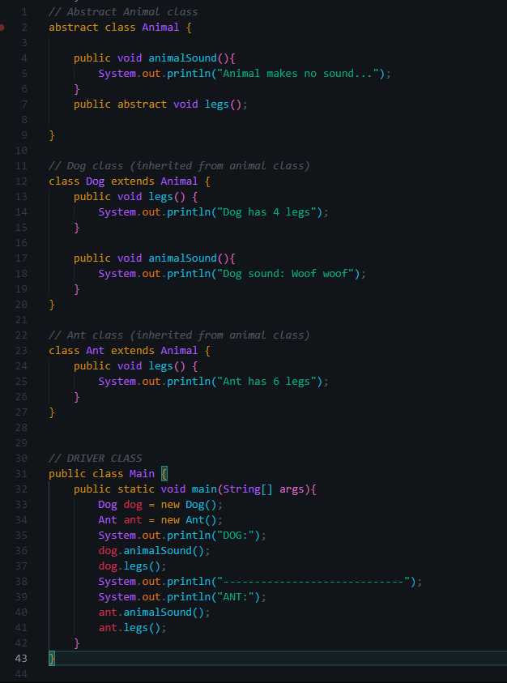
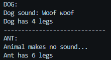

# Adrian Basuki | 2702298210 | L2AC 
Exercise 01 - DSA LAB 2024

## 📁 FILE LOCATION
Exercise01-DSA_LAB > src > Main.java 

**Driver class is contained within the main file**

## 📸 SCREENSHOT

## 📙 CODE EXPLANATION 

### Animal Class
Animal class is an abstract class which means that it cannot be used to create objects. It must be inherited from another class to be accessed. In this case, it is inherited by the Dog and Ant class.

This class contains two methods:
* animalSound -> a method that prints "Animal makes no sound..." in the console when the method is not overridden in the other class (default value)
* legs -> abstract method that does not have a body

### Dog Class
This class is inherited from the main Animal class and it contains two methods: animalSound and legs. The animalSound method here overriddes the animalSound method in the Animal class. The body of the legs method is provided in this class. 

### Ant Class
This class is also inherited from the main Animal class and it contains the legs method which means that the body of the abstract legs method is also provided in this class. 
